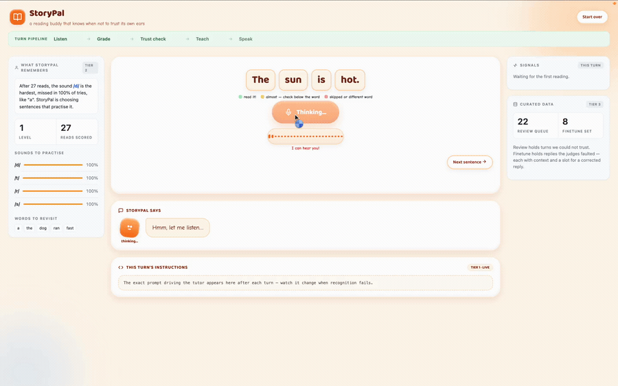

# StoryPal

A voice reading companion for children, built as a working slice of an agentic
platform: a live voice loop plus the learning timescales that let the system
adapt to a child immediately and improve itself over time.

**The design question this project answers: when an agent's own perception is
unreliable, how should the system behave, and how does it learn from that?**



*The moment the whole architecture exists for. The recogniser returned a
transcript it was not confident in, so the trust check fails, the reading
score is discarded, the turn is routed for human review, and the child simply
hears "let's try reading that sentence one more time". Nothing is written to
their record and the sentence does not advance, because the system does not
know what they said.*

## Why reading practice

Most conversational agents cannot be scored objectively, because there is no
ground truth for "was that a good reply?". Reading practice is different. The
target sentence is on the screen, so what the child should have said is known
exactly. That makes the core assessment deterministic, a word by word
alignment rather than a matter of judgment.

It also sits on a known risk. Children's speech is one of the hardest inputs
for speech recognition, and weak recognisers do not merely mishear. They
fabricate words that were never spoken, and they silently repair words that
were spoken badly. In a reading tutor both failures are harmful: the system
either corrects a child who was right, or praises a mistake. This
architecture treats recognition confidence as a first class signal for
exactly that reason.

## Architecture

```
BROWSER                      API (FastAPI)                          EXTERNAL
────────                     ─────────────                          ────────
🎤 record ── POST /api/turn ──► asr.py ──────────────────────────►  Whisper (local)
                                  │  transcript + confidence
                                  │  telemetry
                                  ▼
                    ┌── SYNC PRE-LOOP (deterministic, free) ──┐
                    │  session.py     choose the frame:        │
                    │                 reading, drill or chat   │
                    │  S1 reading accuracy                     │
                    │  S2 recogniser reliability ◄── gates S1  │
                    └──────────────────┬───────────────────────┘
                                       ▼
                                  prompt.py   (signals + profile + tactic)
                                       ▼
                                  agent/loop.py ─────────────►  Gemini 2.5 Flash
                                       ▼
                                  tts.py  ───────────────────►  Higgs TTS 3
                                       │                        (Boson API)
🔊 play ◄── JSON reply ────────────────┘
                                       │
                    ┌── ASYNC POST-LOOP (after reply is sent) ─┐
                    │  S3 tutor grounding   (LLM judge)        │
                    │  S4 pedagogical fit   (LLM judge)        │
                    │  triage.py ──► curated data              │
                    │  observability ──► Langfuse (optional)   │
                    └──────────────────────────────────────────┘
```

The deterministic signals run inside the turn. The judges run after the reply
has been sent, so quality control never sits on the latency path.

## The signals

**S1, reading accuracy.** Word level alignment against the known sentence.
Deterministic. Reports correct, near miss, substituted and missed words.

**S2, recogniser reliability.** Decides whether S1 may be trusted at all,
using two independent kinds of evidence. First, the recogniser's own
telemetry: average log probability, no speech probability and compression
ratio, all reported by Whisper. Second, target anchored novelty: content that
cannot be explained by the sentence on screen. Fabrication is detected by
contiguity rather than volume, because invented content arrives as a phrase
("thanks for watching") while a child's self talk arrives as scattered single
words ("um ... i did it"), and the two carry identical novel word counts.

**S3, tutor grounding.** An LLM judge asking whether the reply claimed
anything the assessment does not support.

**S4, pedagogical fit.** An LLM judge asking whether the reply was kind,
age appropriate and aimed at the right target.

S2 is the safeguard, and it gates four separate things: what the tutor says,
what the learner profile remembers, whether the child advances, and which
data reaches training.

## How the system learns

Four loops at four speeds. Only the slowest involves training.

**Every turn, free.** Live feedback is compiled into the prompt, which is
rebuilt from scratch each turn rather than accumulated as chat history. That
keeps behaviour reproducible from state, which is what makes the transparency
endpoint and the evaluation harness possible.

**Every session, free.** A small learner profile records weak sounds, hard
words and the current level. Turns that S2 rejected never write to it, so
recognition artifacts cannot poison a child's record. Sounds are counted only
where spelling reliably predicts pronunciation, so a missed word may be
recorded without blaming any sound.

**Every few turns, free.** Each teaching tactic keeps a success scoreboard per
child, so retrieval prefers the method that has actually worked for them. The
tactics themselves come from established reading instruction rather than
invention: Orton Gillingham articulatory cues, Elkonin sound boxes adapted to
finger taps for an audio only channel, minimal pairs aimed at the
substitutions children actually make, onset rime word families, and gradual
release. Every tactic records the method it came from.

**Every few weeks, on GPUs.** Turns where the tutor itself replied badly are
curated with full context, the judges' verdicts and a slot for a corrected
reply, producing a dataset ready for supervised or preference fine tuning. No
training is run here. The judgment about what is worth learning from is the
part this project implements.

## Evaluation

Four layers, because each catches failures the others cannot see.

**Unit tests.** 216 tests covering every module, with no network access.

**Case evaluation.** 28 labelled cases replayed through the real pipeline,
reporting alignment correctness and a confusion matrix for hallucination
detection. Currently precision 1.00 and recall 1.00.

**Adversarial cases.** Twelve of those cases were written to break the system
rather than to pass it, and two of them did. A transcript consisting of the
sentence plus an invented tail scored a perfect read and advanced the child,
because the fabrication was a minority of the transcript. A failed drill
attempt fell through to whole sentence grading, blaming the child for words
nobody asked them to say. Both are fixed and pinned as regression tests.

**Session simulation.** Five simulated children, each run for 24 turns: a
confident reader, a child who genuinely cannot manage a sound yet, a tired
child who reads correctly but is misheard, a chatterbox, and a frustrated
child who refuses and goes quiet. Each utterance carries both what the child
voiced and what the recogniser reported, so the simulation can measure the
failure that matters most, which is correcting a child who read perfectly.

**Audio to audio evaluation.** A second agent plays the child and speaks
through Higgs TTS, and the real Whisper listens. This is the only layer that
exercises the actual recogniser rather than a fabricated transcript. Results
across 21 spoken turns: zero false corrections, and the recogniser reproduced
what was voiced in 18 of 21 cases.

That evaluation produced evidence for a limitation this project had only been
able to assert. A child agent that voiced "dis fish is big" was transcribed as
"where this fish is big." and scored one hundred percent. The child
substituted a sound they could not make, the recogniser repaired it, and the
system praised the mistake. S2 cannot detect this, because nothing about the
transcript looks wrong. Fabrication is visible; repair is not.

Writing this test also demonstrated why audio evaluation is worth the cost.
An earlier version of the child agent mispronounced "sun" as "son", which the
report duly flagged as a repair by the recogniser. It was nothing of the kind.
The two words are homophones, the synthesiser produced identical audio, and
the recogniser transcribed it correctly. A tutor that listens cannot
distinguish homophones and should not try, because the child pronounced the
word correctly. The fabricated transcript suites could never have surfaced
that distinction, because they never produce sound.

## API design

The interface is deliberately small. One endpoint carries the whole
conversation, a few carry session control, and the rest exist to make the
system's reasoning inspectable from outside.

**`POST /api/turn`** is the only endpoint that matters. It accepts an audio
recording and the sentence the child was asked to read, and returns
everything about that turn in a single response: the transcript, the word by
word assessment, every signal with its reasons, the tutor's reply, a URL for
the spoken audio, any tools the agent called, the next sentence, the exact
prompt used, the chosen delivery style and the per stage timings. One request
and one response per spoken turn, with no polling for the reply and no socket
to manage.

Returning the prompt and the signals alongside the reply is the important
choice. A conventional design would return only the reply and keep the
reasoning server side. Exposing it makes the interface self describing: the
page renders the decision chain without needing a parallel debug channel, and
anyone reading the response can see exactly why the tutor said what it said.

**Session control** is three endpoints, each doing one thing.
`POST /api/greet` returns the spoken welcome, which differs for a new and a
returning learner. `POST /api/warmup` accepts a recording of the child saying
hello and confirms whether the microphone is working, grading nothing and
touching no memory. `POST /api/next` skips to another sentence, and
`POST /api/reset` clears the learner and starts over.

**Inspection** is three read only endpoints that exist for the same reason as
the fields above. `GET /api/profile` returns the accumulated learner memory,
`GET /api/curated` returns the training data piles and the most recent judge
verdicts, and `GET /api/prompt` returns the exact prompt used on the last
turn. That last one is the transparency claim made concrete: the adaptation
can be observed rather than asserted.

Two design decisions are worth naming. The **judges run in a background task**
rather than inside the request, so `POST /api/turn` returns as soon as the
child's audio is ready, and the verdict is collected afterwards through
`GET /api/curated`. Verdicts carry the turn number they belong to, so a caller
can tell a fresh verdict from a stale one. And **the server holds session
state**, since a reading session is inherently stateful and the client should
not be trusted to report what a child was asked to read.

## Project layout

```
src/storypal/
  config.py     thresholds, story catalogue, phoneme rules
  core/         assessment, signals, triage, trajectory
  learning/     profile, knowledge bases, prompt, curated data
  agent/        provider interface, turn loop, tools, judges
  speech/       recognition and synthesis
  session.py    turn framing and progression decisions
  api/          FastAPI wiring
web/            single page interface, no build step
eval/           case suites, personas, session and audio evaluation
tests/          one test module per source module
```

## Setup

```bash
python3.12 -m venv .venv && source .venv/bin/activate
pip install -e ".[dev]"
brew install ffmpeg
cp .env.example .env      # then add your API keys
./run.sh                  # serves on http://127.0.0.1:8000
```

`run.sh` sets `PYTHONPATH=src` rather than relying on the virtual
environment's path files, because iCloud sync marks those files hidden and
Python 3.12.10 and later skip hidden path files.

Run the evaluation suites:

```bash
pytest                                   # unit tests and case suites
PYTHONPATH=src python -m eval.run_eval   # metrics report
PYTHONPATH=src python -m eval.simulate   # session simulation
PYTHONPATH=src python -m eval.audio_loop # audio to audio, needs API keys
```

## Design decisions

**No orchestration framework.** Control flow is the most safety critical part
of this system, so every branch of it is explicit, testable code. A framework
would be justified by multi agent handoffs, cyclic graphs or durable
execution, none of which this system has.

**No vector store.** Retrieval over a corpus this small is tag lookup. A
vector store would add operational weight and hide a decision that fits in
one function.

**No chat history.** Turn state is distilled into structured facts and the
prompt is rebuilt from them. Behaviour is therefore reproducible from state,
the prompt stays a constant size across a long session, and memory writes can
be gated on recognition quality, which is not possible when raw history simply
accumulates.

**A deliberately small job for the model.** The language model handles the one
thing it is genuinely best at, which is phrasing warmth for a child. Trust,
memory, progression and routing remain in deterministic code.

## Limitations

**Autocorrection is undetectable.** Measured, not assumed: see the audio
evaluation above. A phoneme level acoustic model is the real fix.

**Caution has a cost.** The simulated tired child is perfectly protected and
completely stuck, advancing zero sentences across 24 turns. The remedy is a
better acoustic model rather than a looser threshold.

**Phonemes are inferred from spelling.** Sounds are counted only at positions
where spelling predicts pronunciation, and the story catalogue is built from
decodable words, which narrows the problem without eliminating it.

**Homophones are indistinguishable, by nature.** A child who reads "son" for
"sun" has pronounced the word correctly, so no system that listens can call
it an error. Catching that requires comprehension or spelling, not decoding.

**Judges are unvalidated.** S3 and S4 have not been measured against human
ratings, which is why their output routes to a review queue rather than
directly to action.

**Turn taking is push to talk.** Barge in and interruption recovery need a
live speech to speech runtime.

**The learner profile is a single file.** Multi tenancy is out of scope.
